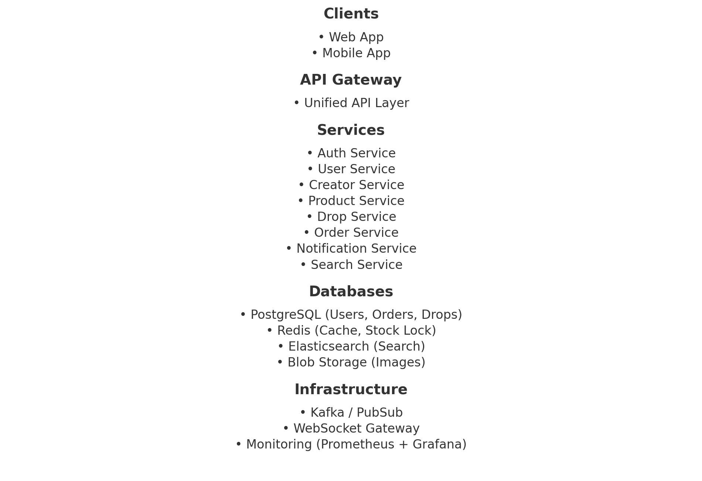

# LiveDrop – Charbel Chalouhy

A real-time flash-sale platform where creators host limited-inventory product drops.

##  Architecture Diagram



**https://excalidraw.com/#json=Flmay_WPVbFKep44DYcMz,VM02tfdSKEy_xXfh9ljAYg**  
(Also included as `LiveDrop-CharbelChalouhy`)

##  Key Features

- Real-time drop notifications (WebSocket/Kafka)
- No overselling: atomic stock handling via Redis
- Follower system built for "celebrity" scale
- Search, pagination, and low-latency APIs
- Fully idempotent and secure order system

##  Project Structure

```
livedrop-CharbelChalouhy/
├── README.md
├── architecture_diagram.png
├── architecture.excalidraw
├── api/
│   └── public_api.md
├── models/
│   └── schema.sql
├── docs/
│   └── tradeoffs.md
```

##  Public API

See [`api/public_api.md`](api/public_api.md)

##  Data Models

See [`models/schema.sql`](models/schema.sql)

##  Design Tradeoffs

See [`docs/tradeoffs.md`](docs/tradeoffs.md)
